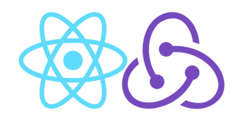

Небольшое SPA-приложение по покупке пиццы.

Стек: React, Redux.

##############################################

Библиотеки к проекту: Axios, content loader, json server. Стилизация на SCSS. Проект залит на Heroku

Данный проект можно склонировать к себе на компьютер через терминал введя команду : git clone https://github.com/webdevmurad/react-redux_pizza.git

Потом введите команду: npm i или npm install, разницы нет. (Для установления зависимостей.)

И последнюю команду которую вы должны ввести : npm start , для того чтобы проект запустился.

##############################################

[Demo Spa приложения можно посмотреть здесь ](https://react-pizza-project.herokuapp.com)
